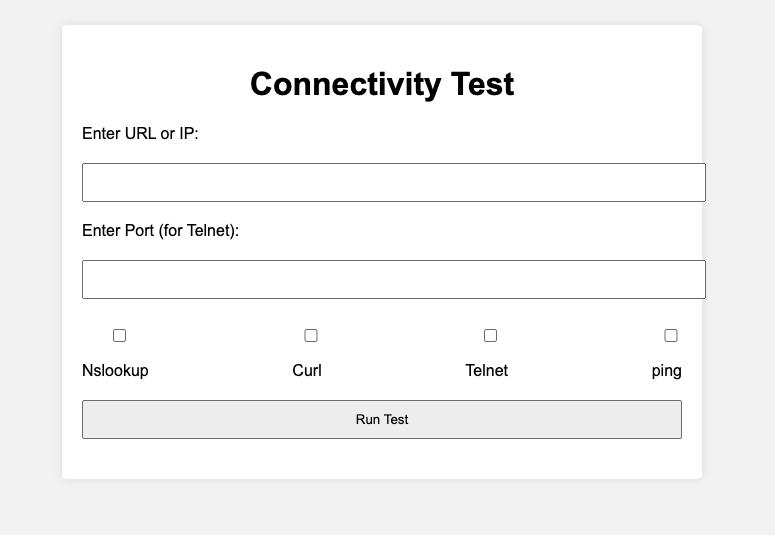
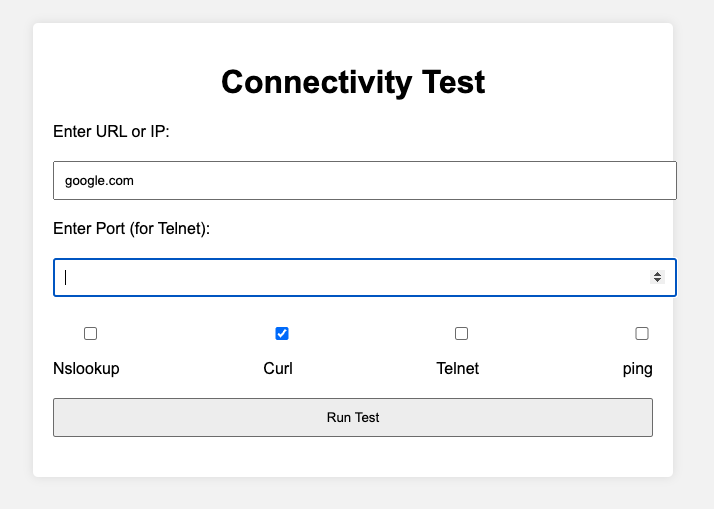
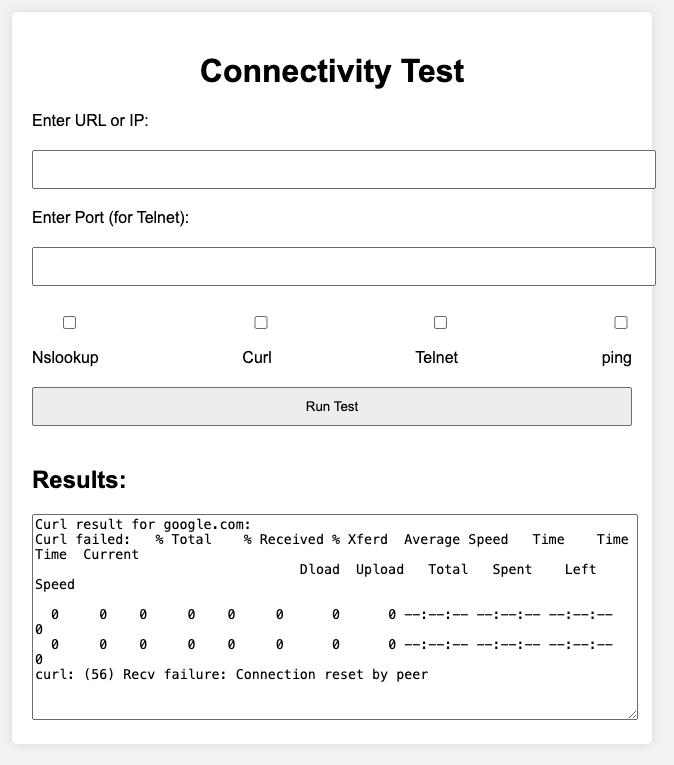
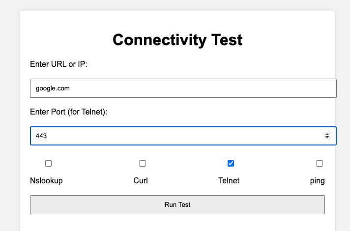
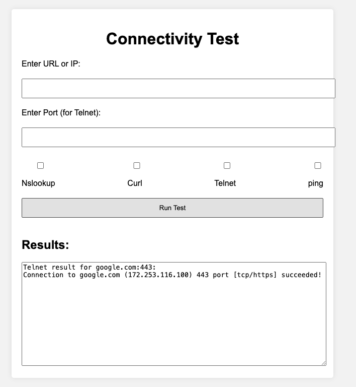
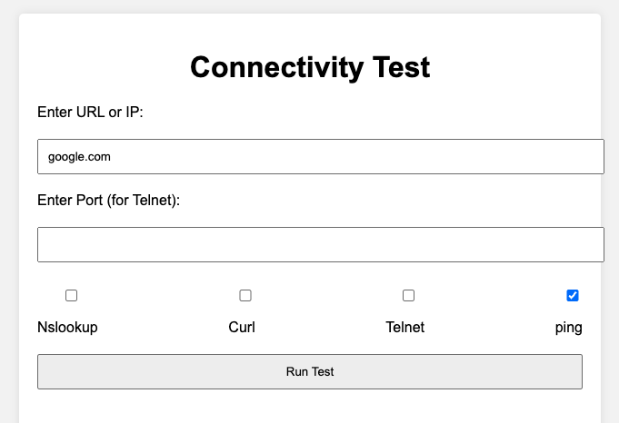
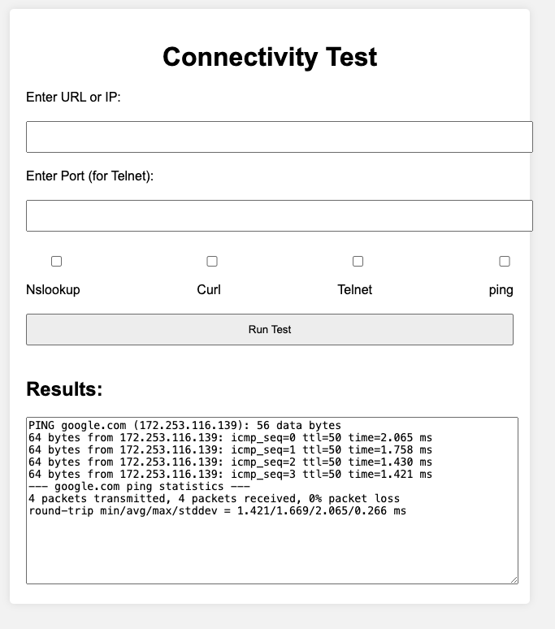
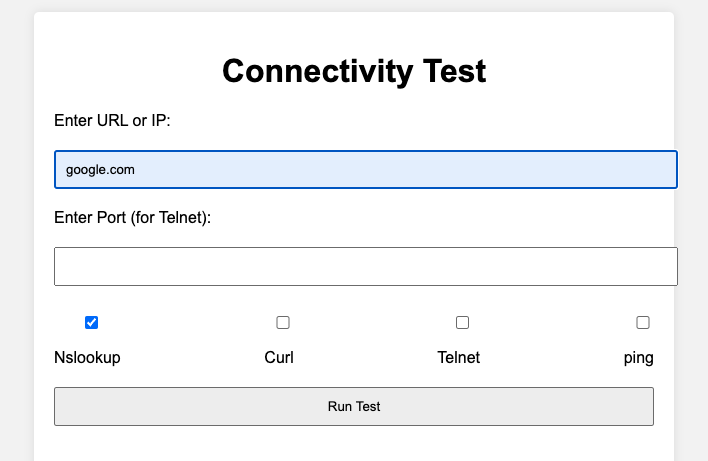
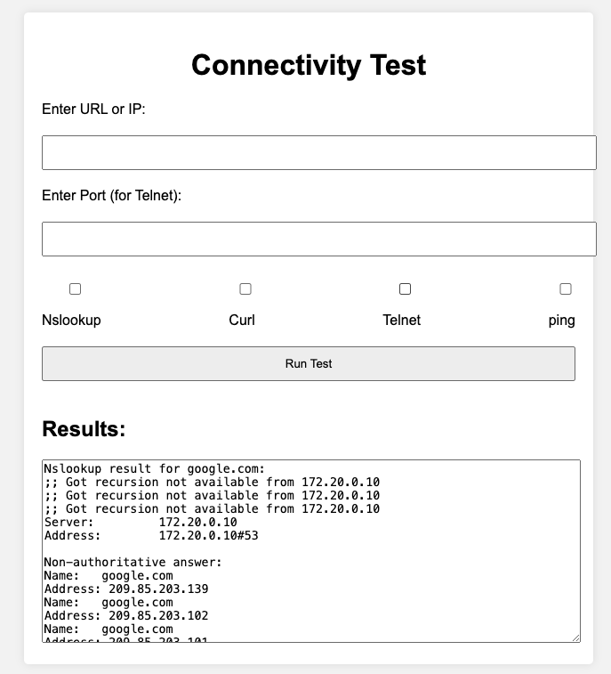

# Network Connectivity Test

## Overview

Test Network Connectivity in your private environment.
This application give you option to test nslookup, curl, telnet and ping.












## how to build docker image

```shell
docker build -t connectivitytest .
```

## locally development

```shell
docker-compose up --build
```